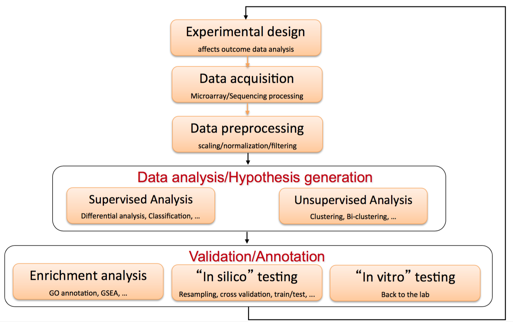
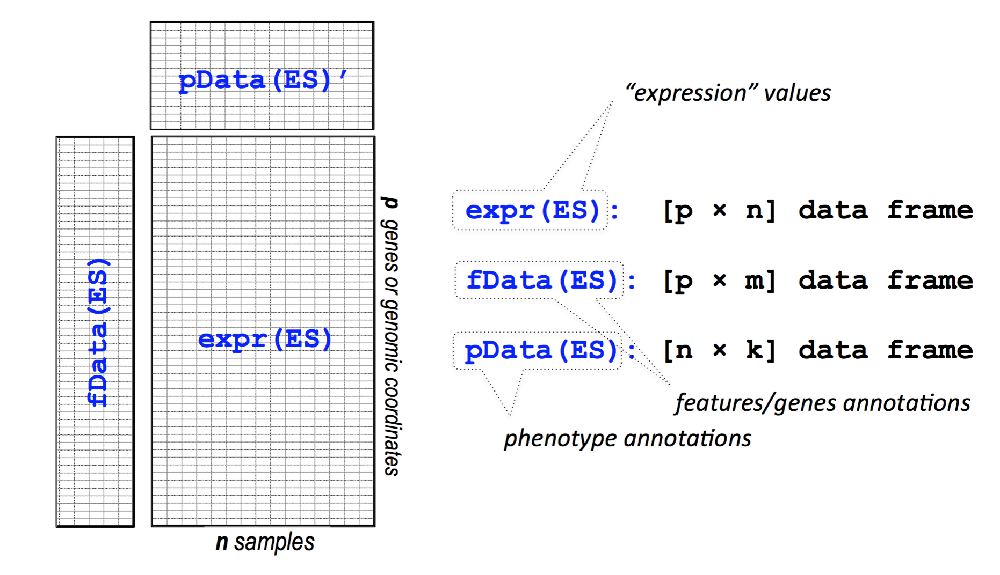
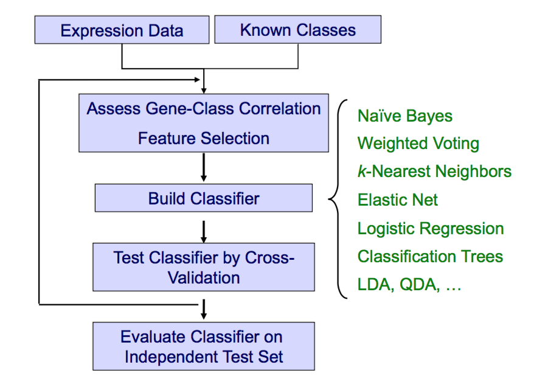

#### Author: Gabriele Sotto

#### Supervisors: Stefano Monti & Riccardo Bellazzi

## Introduction

In the last years there has been a great increment of genomic data due to the advances in various high-throughput biotechnologies such as RNA gene expression microarrays or NGS technologies. These large genomic data sets are information-rich and contain a lot of information. Such an enormous data volume enables new types of analyses, but also makes it difficult to answer research questions using traditional methods.
One of the challenges in this field is the high dimensional nature of biological data. In genomic data analysis, many gene targets are investigated simultaneously, yielding dramatically sparse data points in the corresponding high-dimensional data space. It is well known that mathematical and computational approaches often fail to capture such high dimensional phenomena accurately.
We have a “small n and large p” problem. In fact “n”, the number of independent observations and subjects, is much small than the number of candidate prediction parameters and targets, namely “p”. Also we have much noise in this data, because biological information and signals of interest are often observed with many other random or confounding factors. For these reasons it's important to apply a various of methods for explore the data and perform a features selection for decrese the number of prediction parameters.


<div align="center">
  
</div>

In this work we analyse two datasets: a lymphoma dataset from Affymetrix gene expression microarrays, as
described in 
<a href="http://content.nejm.org/cgi/content/abstract/359/22/2313">Lenz
et al., NEJM 2008</a>; 
and  the TCGA Head and Neck Squamous Carcinoma (HNSC) dataset of RNA-seq expression profiles partially
described in 
<a href="http://www.nature.com/nature/journal/v517/n7536/full/nature14129.html?WT.ec_id=NATURE-20150129">Lawrence et al., Nature 2015</a>.


## 1. Analysis of a Diffuse Large B-Cell Lymphoma (DLBCL) dataset

These data were obtained from 414 patients with newly diagnosed diffuse large-B-cell lymphoma who were treated at 10 institutions in North America and Europe.
Although diffuse large-B-cell lymphoma is curable with anthracycline-based chemotherapy regimens such as a combination of cyclophosphamide, doxorubicin, vincristine, and prednisone (CHOP), the addition of rituximab immunotherapy (R-CHOP) has improved overall survival among patients with diffuse large-B-cell lymphoma by 10 to 15%. Diffuse large-B-cell lymphoma is a molecularly heterogeneous disease, and it is unclear whether rituximab preferentially improves the outcome in certain subgroups of patients.
Among these patients, a CHOP training group consisted of 181 patients, previously described, who were treated with anthracycline-based combinations, most often CHOP or similar regimens. The other 233 patients constituted an R-CHOP cohort that received similar chemotherapy plus rituximab. 


Cell-of-Origin (COO) categorization into Germinal Center B-Cell (GCB) and Activated B-Cell (ABC) are the two classes and we want to build a classifier able to predict the class of a sample starting from the expression matrix. 


We start with installing the required packages:

```{r start, warning=FALSE, message=FALSE}
#source("http://bioconductor.org/biocLite.R")
#biocLite(c("GEOquery", "frma", "ArrayExpress", "biomaRt"))
#install.packages(c("pROC","caret"),repos="http://cran.r-project.org")

library(GEOquery)
library(ArrayExpress)
library(frma)
library(biomaRt)
library(reshape2)
require(Biobase)
require(CBMRtools)
require(caret)
require(limma)
library(VennDiagram)
library(rgl)
require(affy)

PATH <- "data/"

```

After this step we load the dataset and we RMA-process the data. It's important in this early step to annotate the probesets (the rows of the dataset) with gene symbols. We used biomaRt, and then merge multiple probesets with the function "collapseByMedian". 

```{r geo, warning=FALSE, message=FALSE}

DATA<-readRDS(paste(PATH,"lymphoma_lenz.frma.ensg.RDS",sep=""))
DATA


#collapse eset by specified rowid (column name in fData)
#if duplicate rows appear, use the median among rows for each column

collapseByMedian<-function(eset, rowid){
    #library(reshape2)

    #remove unmapped probe sets
    genes<-fData(eset)[, rowid]
    rows.mapped<-!is.na(genes) & genes != ""
    eset<-eset[rows.mapped,]
    genes<-fData(eset)[, rowid]

    #collapse by median value among duplicate probes
    df<-data.frame(exprs(eset), genes = genes)
    df.melt<-melt(df, id.vars = "genes")
    df.median.collapsed<-dcast(df.melt, genes ~ variable, median, fill=NaN)

    #reassemble collapsed eset
    fdat<-fData(eset)
    fdat.collapsed<-fdat[!duplicated(fdat[, rowid]), ] #keep first rows of duplicated fData entries
    row.order<-match(fdat.collapsed[, rowid], df.median.collapsed$genes)
    df.median.collapsed <-df.median.collapsed[row.order,]
    exprs(eset)<-as.matrix(df.median.collapsed[, colnames(eset)])
    fData(eset)<-fdat.collapsed
    return(eset)
}

setwd("~/Desktop/Advanced_data_mining/Lezioni_Monti/data/GSE10846_RAW")
data <- justRMA() 

mart <- useMart(biomart = "ensembl", dataset = "hsapiens_gene_ensembl")

mapping<-getBM(attributes=c("affy_hg_u133_plus_2","hgnc_symbol","description","ensembl_gene_id"),
               filters="affy_hg_u133_plus_2", 
               values=featureNames(data), 
               mart=mart)
head(mapping)

rows.match<-match(featureNames(data), mapping$affy_hg_u133_plus_2)
fdat.new<-cbind(fData(data), mapping[rows.match,])
fData(data)<-fdat.new

#collapsing duplicate gene symbols by symbol
data.collapsed<-collapseByMedian(data, "hgnc_symbol")
fData(DATA)<-fData(data.collapsed)
exprs(DATA)<-exprs(data.collapsed)

```

After this step, before starting with the analysis, we have modified the dataset by deleting the samples that are not classified:

```{r begin, warning=FALSE, message=FALSE}

ind <- which(DATA$COO != "Unclassified")

# exclude "unclassified" samples
DATA <- DATA[,ind]
DATA <- DATA[,DATA$COO %in% c("ABC","GCB")]
DATA$COO <- factor(DATA$COO)     #we removed the unclass

saveRDS(DATA, paste(PATH, "/", "GSE10846_lymphoma_lenz.RDS", sep = ""))

#DATA<-readRDS(paste(PATH,"GSE10846_lymphoma_lenz.RDS",sep=""))

```

The structure of the data frame can be summarized in the following picture:

<div align="center">
  
</div>

Now we can start with the first analysis. The RCHOP cohort will be used as the discovery set, and the CHOP cohort will be used as the validation cohort.

### 1.1 Principal Component Analysis (PCA)

We start by perform a Principal Component Analysis (PCA) and plot data onto the first two PCs, and the 1st and 3rd PCs, by coloring the data points by treatment, by gender and by COO.

```{r pca, warning=FALSE, message=FALSE}

require(rgl)
require(ggplot2)

# run PCA
data.pca <- prcomp(t(exprs(DATA)))  
data.pca1.2 <- data.pca$x[,1:2] # take the first 2 components
data.pca1.3 <- data.pca$x[,1:3] # take the first component and the third

(summary(data.pca)$importance)[,1:50]

## extract label
col.palette <- c("green","red","gray")

# GENDER
colors <- col.palette[as.numeric(as.factor(DATA$Gender))]
## basic 2D plot
plot(x=data.pca1.2[,1],y=data.pca1.2[,2],pch=20,xlab="1st PCA",ylab="2nd PCA",col=colors) # plot the first 2 components
legend("topleft",pch=20,legend=levels(as.factor(DATA$Gender)), col=col.palette)

plot(x=data.pca1.3[,1],y=data.pca1.3[,3],pch=20,xlab="1st PCA",ylab="3rd PCA",col=colors) # plot the first component and the third
legend("topleft",pch=20,legend=levels(as.factor(DATA$Gender)), col=col.palette)


#TREATMENT
colors <- col.palette[as.numeric(as.factor(DATA$Treatment_Regimen))]
## basic 2D plot
plot(x=data.pca1.2[,1],y=data.pca1.2[,2],pch=20,xlab="1st PCA",ylab="2nd PCA",col=colors)
legend("topleft",pch=20,legend=levels(as.factor(DATA$Treatment_Regimen)), col=col.palette)

plot(x=data.pca1.3[,1],y=data.pca1.3[,3],pch=20,xlab="1st PCA",ylab="3rd PCA",col=colors)
legend("topleft",pch=20,legend=levels(as.factor(DATA$Treatment_Regimen)), col=col.palette)


#COO
colors <- col.palette[as.numeric(as.factor(DATA$COO))]
## basic 2D plot
plot(x=data.pca1.2[,1],y=data.pca1.2[,2],pch=20,xlab="1st PCA",ylab="2nd PCA",col=colors)
legend("topleft",pch=20,legend=levels(as.factor(DATA$COO)), col=col.palette)

plot(x=data.pca1.3[,1],y=data.pca1.3[,3],pch=20,xlab="1st PCA",ylab="3rd PCA",col=colors)
legend("topleft",pch=20,legend=levels(as.factor(DATA$COO)), col=col.palette)

```

As we can see, plotting the first three components of PCA, we note that we have a natural separation of the data if we consider the treatment. However we note that the space distribution of these two populations are very similiar and is possible that there is only a scale factor between these cluster. In future we consider the two populations subjected to different treatments as two different datasets, one for training and one for the validation step.
For the other features we note that there are no natural clusters that stand out at first sight except for the COO class: in fact we can note that, if we consider the first and the third PCs, we can easily identify two clusters in which we find examples labeled.
On the basis of these results we can think that it might be possible to build a classifier based on the genes'expression in the different samples.


### 1.2 Hierarchical clustering

In this section we report the results obtained by performing hierarchical clustering of both genes and samples. In particular we have generated a corresponding heatmap of all the data with sample color-coding indicating COO (GCB, ABC), gender and the treatment (CHOP vs. RCHOP). For do this, we have used a drastic variation filter to reduce the number of genes: this clustering is mostly for exploratory purposes and to visually inspect the data. The heatmaps are built using two different packages.

```{r hierarchial clustering, warning=FALSE, message=FALSE}

require(heatmap.plus)

## Variation filtering: reducing the expression dataset to the 3000 genes with the highest MAD

DATAF <- variationFilter(DATA,ngenes=3000,do.plot=TRUE)

## first define a simple function to create a color gradient

colGradient <- function( cols, length, cmax=255 )
{
  ramp <- colorRamp(cols)
  rgb( ramp(seq(0,1,length=length)), max=cmax )
}

## color coding of the samples

CSC <- cbind(COO=c("green","pink")[match(DATAF$COO,c("GCB","ABC"))],
             GEND=c("red","blue","black")[match(DATAF$Gender,c("female","male","N/A"))],
             TREAT=c("magenta","lightblue")[match(DATAF$Treatment_Regimen,c("CHOP-Like","R-CHOP-Like"))])


## color gradient for the expression levels (blue=down-regulated; white=neutral; red=up-regulated)
bwrPalette <- colGradient(c("blue","white","red"),length=13)

## cluster rows (genes) and columns (samples)
hc.row <- hclust(as.dist(1-cor(t(exprs(DATAF)))),method="ward.D2") # genes by correlation
hc.col <- hclust(dist(t(exprs(DATAF))),method="ward.D2")           # samples by euclidean distance (default)

## draw the heatmap
heatmap.plus(exprs(DATAF),Rowv=as.dendrogram(hc.row),Colv=as.dendrogram(hc.col),col=bwrPalette,ColSideColors=CSC,labCol=NA,labRow=NA)

## since this is a step always worth performing, let's define a simple function that implements the necessary steps

hcopt <- function(d, HC=NULL, method = "ward.D", members = NULL)
{
  if ( is.null(HC) ) { 
    HC <- hclust(d,method=method,members=members)
  }
  ORD <- order.optimal(d,merge=HC$merge)
  HC$merge <- ORD$merge
  HC$order <- ORD$order
  HC
}

hc.row <- hcopt(as.dist(1-cor(t(exprs(DATAF)))),method="ward.D2") # genes by correlation
hc.col <- hcopt(dist(t(exprs(DATAF))),method="ward.D2")            # samples by euclidean distance (default)
heatmap.plus(exprs(DATAF),Rowv=as.dendrogram(hc.row),Colv=as.dendrogram(hc.col),col=bwrPalette,ColSideColors=CSC,labCol=NA,labRow=NA)


##### Using the package gplots

library(ConsensusClusterPlus)
library(gplots)

distmatrix.col<-dist(t(exprs(DATAF)))
## using ward clustering 
hc01.col <- hclust(distmatrix.col,method="ward.D") 
hc01.col 

## calculate distance matrix for rows: use correlation for rows/genes
distmatrix.row<-as.dist(1-cor(t(exprs(DATAF))))
## using ward clustering
hc01.row <- hclust(distmatrix.row,method="ward.D") 

## making heatmap
levels(as.factor(DATAF$COO))

col.palette <- c("green", "purple")
colors <- col.palette[as.numeric(as.factor(DATAF$COO))]
heatmaptitle <- paste(" ", "top MAD-filtered 3k genes", sep = "")
heatmap.2(exprs(DATAF),
          trace='none',
          main=heatmaptitle,
          col=bluered(64),
          dendrogram='both',
          scale='row',
          ColSideColors=colors,
          Colv=as.dendrogram(hc01.col),
          Rowv=as.dendrogram(hc01.row),
          margins=c(6,6))
legend("topright", c('ABC','GCB'),
       pch=15,pt.cex=2,col=col.palette,ncol=1,title.adj=0,cex=1,bty='n')


## making heatmap for gender 

levels(as.factor(DATAF$Gender))

col.palette <- c("green", "purple","red")
colors <- col.palette[as.numeric(as.factor(DATAF$Gender))]
heatmaptitle <- paste(" ", "top MAD-filtered 3k genes", sep = "")
heatmap.2(exprs(DATAF),
          trace='none',
          main=heatmaptitle,
          col=bluered(64),
          dendrogram='both',
          scale='row',
          ColSideColors=colors,
          Colv=as.dendrogram(hc01.col),
          Rowv=as.dendrogram(hc01.row),
          margins=c(6,6))
legend("topright", c('female','male','N/A'),
       pch=15,pt.cex=2,col=col.palette,ncol=1,title.adj=0,cex=1,bty='n')

## making heatmap for treatment
levels(as.factor(DATAF$Treatment_Regimen))

col.palette <- c("red", "purple")
colors <- col.palette[as.numeric(as.factor(DATAF$Treatment_Regimen))]
heatmaptitle <- paste(" ", "top MAD-filtered 3k genes", sep = "")
heatmap.2(exprs(DATAF),
          trace='none',
          main=heatmaptitle,
          col=bluered(64),
          dendrogram='both',
          scale='row',
          ColSideColors=colors,
          Colv=as.dendrogram(hc01.col),
          Rowv=as.dendrogram(hc01.row),
          margins=c(6,6))
legend("topright", c('CHOP','R-CHOP'),
       pch=15,pt.cex=2,col=col.palette,ncol=1,title.adj=0,cex=1,bty='n')

```

As we can see, we are able to identify some clusters in these data. In particular we note that we are able to divide the data exacly in the two cohort-RCHOP and CHOP (this is the strongest phenotype).


### 1.3 EM-clustering

Now we use an even more drastic variation filter (1000 genes), and perform EM-clustering with the mclust package.Then we plot the data onto the first two PCs and color the data points by cluster. With the mclust package we can choose the best model on the basis of the measure of BIC (bayesian information criterio). The best model is the model that maximize the value of BIC.

```{r em-clustering, warning=FALSE, message=FALSE}

library(mclust)

## Variation filtering: reducing the expression dataset to the 1000 genes with the highest MAD

DATAF <- variationFilter(DATA,ngenes=1000,do.plot=TRUE)

# selection of the best model
BIC <- mclustBIC(t(exprs(DATAF)), G=1:15)
summary(BIC)
BIC
plot(BIC) 

# now we can extract the cluster
MC = Mclust(t(exprs(DATAF)), x = BIC, G=1:15)
summary(MC)

# perform a PCA
data.pca <- prcomp(t(exprs(DATAF)))
data.pca1.2 <- data.pca$x[,1:2] # take the first 2 components
data.pca1.3 <- data.pca$x[,1:3] # take the first component and the third

## extract label
col.palette <- c("green","red","gray","blue","black","yellow","orange","purple","magenta")

# MC-CLUSTER
colors <- col.palette[as.numeric(as.factor(MC$classification))]
# plot onto the first two PCs
plot(x=data.pca1.2[,1],y=data.pca1.2[,2],pch=20,xlab="1st PCA",ylab="2nd PCA",col=colors)
legend("topleft",pch=20,legend=levels(as.factor(MC$classification)), col=col.palette)

```

With this method we can see that we have 9 clusters. It's a very high number and we note on the graphic that the clusters that we have extracted are not clear. The possible reason is that the method overfitting the data or the probabilistic model (the gaussian mixture) that we used it is not good for this data. However these conclusions are not strong because we consider only two components and for doing a more accurate analysis we have to consider more components and observe the clusters in a multi dimensional space.

### 1.4 Differential analysis

Now we perform differential analysis with respect to the “ABC vs. GCB” distinction, using limma and t-test. For doing this step we start to perform variation filtering and then we selected the discovery cohort of 223 R-CHOP-treated samples, in order to reduce the number of hypothesis to test for differential analysis. In particular we choose the standar deviation as variation measure to use and a number of genes equal to 6000. With these analysis we are interested to investigate if we have a significant different gene expression in the two classes.

```{r differential analysis}


#variation filter
DATAF <- variationFilter(DATA,score="sd",ngenes=6000,do.plot=TRUE)

# start by select the R-CHOP cohort 
DATA2F <- DATAF[,DATAF$Treatment_Regimen %in% c("R-CHOP-Like")]

samplesSet <- DATA2F[,order(DATA2F$COO)]
pheno <- samplesSet$COO

## split the data into the two groups
group1 <- exprs(samplesSet)[, pheno =="ABC"]
group2 <- exprs(samplesSet)[, pheno =="GCB"]
dim(group1)  # show the size of group1
dim(group2)  # show the size of group2

## use gene symbols to index the rows (rather than the entrez IDs)
rownames(group1) <- fData(samplesSet)$hgnc_symbol
rownames(group2) <- fData(samplesSet)$hgnc_symbol

```

#### 1.4.1 Differential expression analysis using the limma package

Starting from Limma. Limma is a library for the analysis of gene expression microarray data, especially the use of linear models for analysing designed experiments and the assessment of differential expression. Empirical Bayesian methods are used to provide stable results even when the number of arrays is small. The model that we used in this section include only the class, COO.

```{r Limma}

# using limma
design <- model.matrix(~0 + factor(pheno))
colnames(design) <- c("ABC", "GCB")

contrast.matrix <- makeContrasts(ABC-GCB, levels = design)
fit <- lmFit(samplesSet, design)
fit <- contrasts.fit(fit,contrast.matrix)
fit <- eBayes(fit)
head(fit$coefficients)

#get full differential expression output table, sorted by p-value
limmaRes <- topTable(fit, adjust.method = "BH", n = Inf, sort.by = "P")

```
Now we have to select the most significant genes. For doing this we have to choose a p-value cutoff. In particular we apply a cutoff equal to 0.001.

```{r Limma-best genes}

#subset to genes with adjusted p-value cutoff
adjpcutoff <- 0.001

limmaRes.sig <- subset(limmaRes, adj.P.Val < adjpcutoff)
nrow(limmaRes.sig)
head(limmaRes.sig)

topGenes <- limmaRes.sig$hgnc_symbol
topGenes.up <- subset(limmaRes.sig, t<0)$hgnc_symbol
topGenes.down <- subset(limmaRes.sig, t>=0)$hgnc_symbol

```

In the following picture we report the volcano plot of the q-values (y-axis) against the corresponding differential scores.

```{r Limma volcano plot, warning=FALSE, message=FALSE}

require(calibrate)

# Volcano plot for limma
subset_limma <- limmaRes[, c("hgnc_symbol","logFC","adj.P.Val")]
colnames(subset_limma) <- c("gene","log2FoldChange","q_value")
with(subset_limma, plot(log2FoldChange, -log10(q_value), pch=20, main="Limma Volcano plot"))

# Add colored points: red if adj.P.Val<0.0001, orange if log2FC>1.5, green if both)
with(subset(subset_limma, q_value<.0001 ), points(log2FoldChange, -log10(q_value), pch=20, col="red"))
with(subset(subset_limma, abs(log2FoldChange)>1.5), points(log2FoldChange, -log10(q_value), pch=20,col="orange"))
with(subset(subset_limma, q_value<.0001 & abs(log2FoldChange)>1.5), points(log2FoldChange, -log10(q_value), pch=20,col="green"))
with(subset(subset_limma, q_value<.0001 & abs(log2FoldChange)>1.5), textxy(log2FoldChange, -log10(q_value), labs=gene, cex=.8))

```

#### 1.4.2 Differential expression analysis using t-test and lm

Now we repeat the analysis with other two methods for the differential analysis, a t-test and lm that is used to fit linear models. 

```{r t-test}

## t-test
## apply the t.test to each gene and save the output in a data.frame

ttestRes <- data.frame(t(sapply(1:nrow(group1), 
     function(i){
          res <- t.test(x = group1[i, ], y = group2[i,], alternative ="two.sided")
          res.list <-  c(t.score=res$statistic, 
                         t.pvalue = res$p.value)
          return(res.list)
      })))

## application to all genes 
ttestRes1 <- as.data.frame(t(apply(exprs(samplesSet),1,
                                   function(y) {
                                       out <- t.test(y~pheno,var.equal=TRUE)
                                       c(t.score=out$statistic,t.pvalue=out$p.value)
                                   })))

## use the gene names to index the rows (for interpretability)
rownames(ttestRes1) <- rownames(group1)

## let us add to the output data.frame an extra column reporting the FDR
## .. (i.e., the MHT-corrected p-value)
ttestRes1$t.fdr <- p.adjust(ttestRes1$t.pvalue, method = "BH")

#subset to genes with adjusted p-value cutoff
adjpcutoff <- 0.001
ttestRes1.sig <- subset(ttestRes1, t.fdr < adjpcutoff)

## let us sort the output by t-score
ttestOrd <- order(ttestRes1[,'t.score.t'],decreasing=TRUE)
head(ttestRes1[ttestOrd,])

```

For values of p-value lower we refuse the null hypothesis and we accept the hypothesis for which the expression levels of these genes are different for the classes "ABC" and "GCB".
We now show how to visualize the top markers for each class by means of the heatmap.plus function. We are using our own my.heatmap function, which is a simple wrapper adding few extra features (including the change of the default color palette).

```{r t-test heatmap}

source(paste(PATH,"../code/heatmap.R",sep=""))

## let us visualize the top 50 and bottom 50 genes
hiIdx <- ttestOrd[1:50]
loIdx <- ttestOrd[nrow(ttestRes1):(nrow(ttestRes1)-49)]
datOut <- exprs(samplesSet)[c(hiIdx,loIdx),]

## create a color bar to show sample labels (green=ABC, orange=GCB)
CSC <- rep(c("green","orange"),times=c(ncol(group1),ncol(group2)))
CSC <- cbind(CSC,CSC) # ColSideColors needs to be a matrix 
my.heatmap(datOut,Colv=NA,Rowv=NA,ColSideColors=CSC)

```

From the heatmap we can see that there are genes expressed in a significantly different manner between the two classes.
Now we try to use lm. It is used to fit linear models and it can be used to carry out regression, single stratum analysis of variance and analysis of covariance. We can regress the expression of a gene on the phenotype variable. We apply it to all the genes and we show that the test result is the same as for the t.test with equal variance.

```{r lm}

## application to all genes
lmRes <- as.data.frame(t(apply(exprs(samplesSet),1,
                                   function(y) {
                                       out <- summary(lm(y~pheno))$coefficients
                                       c(t.score=out[2,"t value"],t.pvalue=out[2,"Pr(>|t|)"])
                                   })))

lmRes$t.fdr <- p.adjust(lmRes$t.pvalue, method = "BH")

# the score are the same
all.equal(-ttestRes1$t.score.t,lmRes$t.score) 

```


#### 1.4.3 Comparing t-test and limma results

Now we compare scores and MHT-corrected q-values of the two approaches, limma and t-test, and quantify the overlap of significant genes for a given significance threshold. Then we visualize the overlap as a Venn diagram.

```{r comparing results}

#comparing t-test results to limma results
combinedRes <- cbind(limmaRes, ttestRes1[match(limmaRes$hgnc_symbol, rownames(ttestRes1)),])

plot(combinedRes$t, combinedRes$t.score.t, xlab = "limma t-statistic", ylab = "t-test t-statistic", pch = 20, cex = 0.5)

plot(combinedRes$P.Value, combinedRes$t.pvalue, xlab = "limma p-value", ylab = "t-test pvalue", pch = 20, cex = 0.5)

plot(combinedRes$adj.P.Val, combinedRes$t.fdr, xlab = "limma fdr", ylab = "t-test fdr", pch = 20, cex =0.5)


combinedRes <- cbind(limmaRes.sig, ttestRes1.sig[match(limmaRes.sig$hgnc_symbol, rownames(ttestRes1)),])

#what is the overlap between t-ttest and limma derived significant genes? 
top.ttest <- rownames(combinedRes)[order(combinedRes$t.fdr, decreasing = FALSE)[1:nrow(ttestRes1.sig)]]
top.limma <- rownames(combinedRes)[order(combinedRes$adj.P.Val, decreasing = FALSE)[1:nrow(limmaRes.sig)]]
top <- list(top.ttest = top.ttest, top.limma = top.limma)


fill <- c("light blue","light green")
p <- venn.diagram(x = top, filename = NULL, fill=fill)
grid.newpage()
grid.draw(p)


```

We note that there are not significant differences beetween the two methods.


#### 1.4.4 Differential expression analysis using limma with the control for confounders

Now we repeat the differential analysis, using only limma, but this time controlling for gender and age effect. Also we compare these results to those obtained without controlling for confounders. As we can see we have some significant differences between the previous test results and these. We decided to keep the results of this more complex model for future analysis.


```{r limma with confounders}

phenoGender <- samplesSet$Gender
phenoAge <- samplesSet$Age

# using limma

design <- model.matrix(~0 + factor(pheno) + factor(phenoGender)+phenoAge)
colnames(design) <- c("ABC", "GCB", "Gender","Age")

contrast.matrix <- makeContrasts(ABC-GCB,Gender,Age, levels = design)
fit <- lmFit(samplesSet, design)
fit <- contrasts.fit(fit,contrast.matrix)
fit <- eBayes(fit)
head(fit$coefficients)

#get full differential expression output table
#if we have more than 2 coeff. we use topTableF, using the F-statistic
limmaResConfounders <- topTableF(fit, adjust.method = "BH", n = Inf, sort.by = "F") 

#subset to genes with adjusted p-value cutoff
adjpcutoff <- 0.001  

limmaResConfounders.sig <- subset(limmaResConfounders, adj.P.Val < adjpcutoff)
nrow(limmaResConfounders.sig)
head(limmaResConfounders.sig)

topGenes2 <- limmaResConfounders.sig$hgnc_symbol

out.dir <- paste(PATH,"results",sep="")
saveRDS(topGenes2, paste(out.dir, "/", "topGenesProject2.RDS", sep = ""))


all.equal(limmaRes$adj.P.Val,limmaResConfounders$adj.P.Val)


## the scores are not the same 
plot(limmaRes$adj.P.Val,limmaResConfounders$adj.P.Val,pch=20)

top.limmaRes <- rownames(limmaRes.sig)[order(limmaRes$adj.P.Val, decreasing = FALSE)[1:nrow(limmaRes.sig)]]
top.limmaResConfounders <- rownames(limmaResConfounders.sig)[order(limmaResConfounders.sig$adj.P.Val, decreasing = FALSE)[1:nrow(limmaResConfounders.sig)]]

top <- list(top.limmaRes = top.limmaRes, top.limmaResConfounders = top.limmaResConfounders)

fill <- c("light blue","light green")
p <- venn.diagram(x = top, filename = NULL, fill = fill)
grid.newpage()
grid.draw(p)

```

### 1.5 Gene Set Enrichment

Gene set enrichment is a method to identify classes of genes that are over-represented in a large set of genes, and they may have an association with disease phenotypes. In this section we want to attach a biological meaning to the gene signature. For doing this we can start from the identified signatures in the previous analysis and use a method based on the Hyper-Geometric distribution or consider all genes and use a method based on the Kolmogorov-Smirnov test.

```{r gene set enrichment}

## For the hyperenrichment test we need to download some gene sets from MSigDB, available here:
## http://www.broadinstitute.org/gsea/msigdb/download_file.jsp?filePath=/resources/msigdb/4.0/c2.cp.v4.0.symbols.gmt

gsets <- readLines(paste(PATH,'/c2.cp.v5.0.symbols.gmt',sep=''))
gsets <- strsplit(gsets,'\t')
names(gsets) <- sapply(gsets,function(x)x[1])
gsets <- sapply(gsets,function(x)x[-(1:2)])

```

#### 1.5.1 Hyperenrichment analysis

Now we perform pathway enrichment analysis of the identified signatures. In particular we used hyperenrichment-type analysis, using a method call calcHyper and geneset/pathway compendium (MSigDB).

```{r hyperenrichment}

allGenes <- nrow(DATA)

## define a function to do a Fisher's exact test

calcHyper <- function(geneSet,sig,allGenes){
   a <- length(intersect(sig,geneSet))
   b <- length(geneSet)-a
   c <- length(sig)-a
   d <- allGenes-a-b-c
   cont <- matrix(c(a,b,c,d),ncol=2)
   pVal <- fisher.test(cont)
   return(c(overlap=a,geneset=a+b,sig=c+a,background=allGenes,p.value=pVal$p.value))
}
enrichment <- t(sapply(gsets,calcHyper,topGenes2,allGenes))
enrichment <- cbind(enrichment,adjusted.p=p.adjust(enrichment[,'p.value'],method='BH'))
enrichment <- enrichment[order(enrichment[,'adjusted.p'], decreasing = FALSE),]
enrichment[1:10,]

```

From this analysis we note some interesting things. In fact the ensemble of genes encoding the "matrisome" (the ensemble of extracellular matrix and ECM-associated proteins ) are the ensemble of genes with the major number of overlaps. The extracellular matrix (ECM) is a complex meshwork of cross-linked proteins providing both biophysical and biochemical cues that are important regulators of cell proliferation, survival, differentiation, and migration. Both tumor cells and stromal cells contribute to the production of the tumor matrix and that tumors of differing metastatic potential differ in both the tumor- and the stroma-derived ECM components.

#### 1.5.2 Gene Set Enrichment Analysis (GSEA)

Another way to look for up or down regulated gene sets/pathways is GSEA, implemented in GSEAlm. Gene set enrichment analysis (GSEA) is an approach that correlates a large database of co-regulated gene sets with respect to a microarray or RNA-seq data set. GSEA is a hybrid approach: it is competitive in that different sets are pitted against one another, but significance is evaluated by permutation of sample labels.

```{r GSEA}

library(GSEAlm)

#make incident matrix of genes
makeSigMatrix <- function(sigs,samplesSet, rowid = "hgnc_symbol"){
   all.genes <- fData(samplesSet)[, rowid]
   sigMat <- t(sapply(1:length(sigs),function(i){
        y <- rep(0,length(all.genes))
        names(y) <- all.genes
        x <- sigs[[i]]
        x.id <- match(x, names(y))
        x.id <- x.id[!is.na(x.id)]
        y[x.id] <- 1
        return(y)}))   
   return(sigMat) 
}

#pathway membership matrix for each gene
sigMat <- makeSigMatrix(gsets, samplesSet)

#perform gsealm
res <- gsealmPerm(samplesSet, ~COO,sigMat,nperm=1000)
colnames(res) <- levels(pData(samplesSet)$COO)
rownames(res) <- names(gsets)
res <- data.frame(res)

#histogram of p-values for pathway enrichment
hist(res[,2],10,main="GSEAlm p-values",xlab="p-values for GCB minus ABC",xlim=c(0,1))
hist(res[,1],10,main="GSEAlm p-values",xlab="p-values for ABC minus GCB",xlim=c(0,1))
res.sig.up <- res[order(res[,2], decreasing = FALSE, na.last = TRUE),]
res.sig.down <- res[order(res[,1], decreasing = FALSE, na.last = TRUE),]

#top enriched pathways in GCB (vs. ABC)
head(rownames(res.sig.up))
#top enriched pathways in ABC (vs. GCB)
head(rownames(res.sig.down))

```

Now we want to compare the two methods used for enrichment analysis, in particular we are interested to investigate if the list of pathways found by this second method similar to the one found by the previous one.

```{r enrichment compare}
hyper.pvalue <- as.numeric(enrichment[, "adjusted.p"]) #adjusted pvalues
gsealm.pvalue <- res[rownames(enrichment),1] #permutation based pvalues

plot(hyper.pvalue, gsealm.pvalue)

sig.hyper <- hyper.pvalue < 0.05
sig.gsealm <- gsealm.pvalue < 0.05

table(sig.hyper, sig.gsealm)

```

We note that we have a lot of differences beetween this two methods. The list of pathways found by this method is not similar to the one found by the previous method, however we note that some pathways are the same.

### 1.6 Classification

In this last section we used different classifiers to try to predict the class, starting from different sets of significant genes. In particular for training the classifiers we used two different features sets: in one case we consider all genes in the expression set after the application of the variation filter based on the standard deviation (6000 genes) and the other feature set consist in only the top genes that we have identified with the differential analysis using limma with the control for the counfouders.
The classifiers were trained using the cohort of R-CHOP as training set. We perform also a cross validation to compare the performance of various classifiers and find which of these may be more suited to a classification problem of this type. 

<div align="center">
  
</div>

```{r classification}

## source some custom scripts (all included in the sub-directory code/)
source(paste(PATH,"../code/xvalSelect.R",sep=""))
source(paste(PATH,"../code/knn.R",sep=""))


# training set with the best genes from the diffanal
trainingSet1 <- subset(samplesSet,fData(samplesSet)$hgnc_symbol %in% limmaResConfounders.sig$hgnc_symbol)
# training set with all genes after filtering (6000)
trainingSet2 <- samplesSet

## generate a vector of fold assignments (in this case, 3 folds) for the first features set
set.seed(987) # for reproducible results
split <- xvalSelect(sample.size=ncol(trainingSet1),nfolds=3,cls=pData(trainingSet1)[,"COO"])

trnSet1_1 <- trainingSet1[,split!=1]
trnSet1_2 <- trainingSet1[,split!=2]
trnSet1_3 <- trainingSet1[,split!=3]
tstSet1_1 <- trainingSet1[,split==1]
tstSet1_2 <- trainingSet1[,split==2]
tstSet1_3 <- trainingSet1[,split==3]

table(pData(trnSet1_1)[,"COO"])
table(pData(tstSet1_1)[,"COO"])

rownames(exprs(trnSet1_1))<-fData(trnSet1_1)$hgnc_symbol
rownames(exprs(trnSet1_2))<-fData(trnSet1_2)$hgnc_symbol
rownames(exprs(trnSet1_3))<-fData(trnSet1_3)$hgnc_symbol
rownames(exprs(tstSet1_1))<-fData(tstSet1_1)$hgnc_symbol
rownames(exprs(tstSet1_2))<-fData(tstSet1_2)$hgnc_symbol
rownames(exprs(tstSet1_3))<-fData(tstSet1_3)$hgnc_symbol

#now the same with the second training set
set.seed(987) # for reproducible results
split <- xvalSelect(sample.size=ncol(trainingSet2),nfolds=3,cls=pData(trainingSet2)[,"COO"])

trnSet2_1 <- trainingSet2[,split!=1]
trnSet2_2 <- trainingSet2[,split!=2]
trnSet2_3 <- trainingSet2[,split!=3]
tstSet2_1 <- trainingSet2[,split==1]
tstSet2_2 <- trainingSet2[,split==2]
tstSet2_3 <- trainingSet2[,split==3]

table(pData(trnSet2_1)[,"COO"])
table(pData(tstSet2_1)[,"COO"])

rownames(exprs(trnSet2_1))<-fData(trnSet2_1)$hgnc_symbol
rownames(exprs(trnSet2_2))<-fData(trnSet2_2)$hgnc_symbol
rownames(exprs(trnSet2_3))<-fData(trnSet2_3)$hgnc_symbol
rownames(exprs(tstSet2_1))<-fData(tstSet2_1)$hgnc_symbol
rownames(exprs(tstSet2_2))<-fData(tstSet2_2)$hgnc_symbol
rownames(exprs(tstSet2_3))<-fData(tstSet2_3)$hgnc_symbol


```

#### 1.6.1 Random forest

It's a method that operate by constructing a multitude of decision trees at training time and outputting the class that is the mode of the classes of the individual trees. Random decision forests correct for decision trees' habit of overfitting to their training set.

```{r random forest, warning=FALSE, message=FALSE}

require(randomForest)

# we start with the first features set

RF1_1 <- randomForest(x=t(exprs(trnSet1_1)),y=factor(trnSet1_1$COO),ntree=1000,importance=TRUE)
print(RF1_1)
#prediction on the first Test-fold
RF1_1.pred <- predict(RF1_1, t(exprs(tstSet1_1)))
table(observed = tstSet1_1$COO, predicted = RF1_1.pred)

RF1_2 <- randomForest(x=t(exprs(trnSet1_2)),y=factor(trnSet1_2$COO),ntree=1000,importance=TRUE)
print(RF1_2)
#prediction on the second Test-fold
RF1_2.pred <- predict(RF1_2, t(exprs(tstSet1_2)))
table(observed = tstSet1_2$COO, predicted = RF1_2.pred)

RF1_3 <- randomForest(x=t(exprs(trnSet1_3)),y=factor(trnSet1_3$COO),ntree=1000,importance=TRUE)
print(RF1_3)
#prediction on the third Test-fold
RF1_3.pred <- predict(RF1_3, t(exprs(tstSet1_3)))
table(observed = tstSet1_3$COO, predicted = RF1_3.pred)


# second features set with all genes

RF2_1 <- randomForest(x=t(exprs(trnSet2_1)),y=factor(trnSet2_1$COO),ntree=1000,importance=TRUE)
print(RF2_1)
#prediction on the first Test-fold
RF2_1.pred <- predict(RF2_1, t(exprs(tstSet2_1)))
table(observed = tstSet2_1$COO, predicted = RF2_1.pred)

RF2_2 <- randomForest(x=t(exprs(trnSet2_2)),y=factor(trnSet2_2$COO),ntree=1000,importance=TRUE)
print(RF2_2)
#prediction on the second Test-fold
RF2_2.pred <- predict(RF2_2, t(exprs(tstSet2_2)))
table(observed = tstSet2_2$COO, predicted = RF2_2.pred)

RF2_3 <- randomForest(x=t(exprs(trnSet2_3)),y=factor(trnSet2_3$COO),ntree=1000,importance=TRUE)
print(RF2_3)
#prediction on the third Test-fold
RF2_3.pred <- predict(RF2_3, t(exprs(tstSet2_3)))
table(observed = tstSet2_3$COO, predicted = RF2_3.pred)

```

#### 1.6.2 Adaboost

This is a machine learning meta-algorithm that can be used in conjunction with many other learning algorithms to improve their performance.
It is a method that builds a “strong” binary classifier as a linear combination of “weak” classifiers. The final classification is based on a weighted voting of the different classifiers. Adaboost is adaptive in the sense that subsequent weak learners are tweaked in favour of those instances misclassified by previous classifiers and it is sensitive to noisy data. In some problems it can be less susceptible to the overfitting problem than other learning algorithms. The individual learners can be weak, but as long as the performance of each one is slightly better than random guessing (for example their error rate is smaller than 0.5 for binary classification), the final model can be proven to converge to a strong learner.
The function R that we used implement an algorithm that using classification trees as single classifiers.

```{r adaboost, warning=FALSE, message=FALSE }

library("adabag")

# we start with the first features set

#fold 1
COO<-trnSet1_1$COO
adaboost1_1<-boosting(COO~.,data = cbind(as.data.frame(t(exprs(trnSet1_1))), COO))
COO<-tstSet1_1$COO
adaboost1_1.pred<-predict.boosting(adaboost1_1, newdata = cbind(as.data.frame(t(exprs(tstSet1_1))), COO))
adaboost1_1.pred$confusion
#fold 2
COO<-trnSet1_2$COO
adaboost1_2<-boosting(COO~.,data = cbind(as.data.frame(t(exprs(trnSet1_2))), COO))
COO<-tstSet1_2$COO
adaboost1_2.pred<-predict.boosting(adaboost1_2, newdata = cbind(as.data.frame(t(exprs(tstSet1_2))), COO))
adaboost1_2.pred$confusion
#fold 3
COO<-trnSet1_3$COO
adaboost1_3<-boosting(COO~.,data = cbind(as.data.frame(t(exprs(trnSet1_3))), COO))
COO<-tstSet1_3$COO
adaboost1_3.pred<-predict.boosting(adaboost1_3, newdata = cbind(as.data.frame(t(exprs(tstSet1_3))), COO))
adaboost1_3.pred$confusion

# second features set (6k genes)

#fold 1
COO<-trnSet2_1$COO
adaboost2_1<-boosting(COO~.,data = cbind(as.data.frame(t(exprs(trnSet2_1))), COO))
COO<-tstSet2_1$COO
adaboost2_1.pred<-predict.boosting(adaboost2_1, newdata = cbind(as.data.frame(t(exprs(tstSet2_1))), COO))
adaboost2_1.pred$confusion
#fold 2
COO<-trnSet2_2$COO
adaboost2_2<-boosting(COO~.,data = cbind(as.data.frame(t(exprs(trnSet2_2))), COO))
COO<-tstSet2_2$COO
adaboost2_2.pred<-predict.boosting(adaboost2_2, newdata = cbind(as.data.frame(t(exprs(tstSet2_2))), COO))
adaboost2_2.pred$confusion
#fold 3
COO<-trnSet2_3$COO
adaboost2_3<-boosting(COO~.,data = cbind(as.data.frame(t(exprs(trnSet2_3))), COO))
COO<-tstSet2_3$COO
adaboost2_3.pred<-predict.boosting(adaboost2_3, newdata = cbind(as.data.frame(t(exprs(tstSet2_3))), COO))
adaboost2_3.pred$confusion


```


#### 1.6.3 Logistic regression with LASSO

It is a regression analysis method that performs both variable selection and regularization in order to enhance the prediction accuracy and interpretability of the statistical model it produces. In particular we use a function that fits a traditional logistic regression model with lasso penalty.

```{r lasso-regression, warning=FALSE, message=FALSE}

require(glmnet)

#alpha=1 lasso, =0.5 elastic net

## first training set
#fold 1
regression1_1 <- glmnet(x=t(exprs(trnSet1_1)),y=factor(trnSet1_1$COO), family = "binomial", alpha=1)
cv.regression1_1 <- cv.glmnet(x=t(exprs(trnSet1_1)),y=factor(trnSet1_1$COO),alpha=1, family = "binomial" )

best_lambda <- cv.regression1_1$lambda.min
#prediction on Test Data
regression1_1.pred <- predict(regression1_1, newx = t(exprs(tstSet1_1)),type = "class", s=best_lambda)
#confusion matrix
table(observed = tstSet1_1$COO, predicted = regression1_1.pred)

# fold 2
regression1_2 <- glmnet(x=t(exprs(trnSet1_2)),y=factor(trnSet1_2$COO), family = "binomial", alpha=1)
cv.regression1_2 <- cv.glmnet(x=t(exprs(trnSet1_2)),y=factor(trnSet1_2$COO),alpha=1, family = "binomial" )

best_lambda <- cv.regression1_2$lambda.min
#prediction on Test Data
regression1_2.pred <- predict(regression1_2, newx = t(exprs(tstSet1_2)),type = "class", s=best_lambda)
#confusion matrix
table(observed = tstSet1_2$COO, predicted = regression1_2.pred)

# fold 3
regression1_3 <- glmnet(x=t(exprs(trnSet1_3)),y=factor(trnSet1_3$COO), family = "binomial", alpha=1)
cv.regression1_3 <- cv.glmnet(x=t(exprs(trnSet1_3)),y=factor(trnSet1_3$COO),alpha=1, family = "binomial" )

best_lambda <- cv.regression1_3$lambda.min
#prediction on Test Data
regression1_3.pred <- predict(regression1_3, newx = t(exprs(tstSet1_3)),type = "class", s=best_lambda)
#confusion matrix
table(observed = tstSet1_3$COO, predicted = regression1_3.pred)

## second training set 

#fold 1
regression2_1 <- glmnet(x=t(exprs(trnSet2_1)),y=factor(trnSet2_1$COO), family = "binomial", alpha=1)
cv.regression2_1 <- cv.glmnet(x=t(exprs(trnSet2_1)),y=factor(trnSet2_1$COO),alpha=1, family = "binomial" )

best_lambda <- cv.regression2_1$lambda.min
#prediction on Test Data
regression2_1.pred <- predict(regression2_1, newx = t(exprs(tstSet2_1)),type = "class", s=best_lambda)
#confusion matrix
table(observed = tstSet2_1$COO, predicted = regression2_1.pred)

# fold 2
regression2_2 <- glmnet(x=t(exprs(trnSet2_2)),y=factor(trnSet2_2$COO), family = "binomial", alpha=1)
cv.regression2_2 <- cv.glmnet(x=t(exprs(trnSet2_2)),y=factor(trnSet2_2$COO),alpha=1, family = "binomial" )

best_lambda <- cv.regression2_2$lambda.min
#prediction on Test Data
regression2_2.pred <- predict(regression2_2, newx = t(exprs(tstSet2_2)),type = "class", s=best_lambda)
#confusion matrix
table(observed = tstSet2_2$COO, predicted = regression2_2.pred)

# fold 3
regression2_3 <- glmnet(x=t(exprs(trnSet2_3)),y=factor(trnSet2_3$COO), family = "binomial", alpha=1)
cv.regression2_3 <- cv.glmnet(x=t(exprs(trnSet2_3)),y=factor(trnSet2_3$COO),alpha=1, family = "binomial" )

best_lambda <- cv.regression2_3$lambda.min
#prediction on Test Data
regression2_3.pred <- predict(regression2_3, newx = t(exprs(tstSet2_3)),type = "class", s=best_lambda)
#confusion matrix
table(observed = tstSet2_3$COO, predicted = regression2_3.pred)

```

#### 1.6.4 KNN

It is an easy deployment model that doesn't require any particular assumption about the distribution of data and also, it can work with any type of surface of separation. The model calculates the similarity between the classifing example with the examples of the training set and retrieves the k closest examples. On the basis of this neighborhood it assign the class with a grade which can be normal or weighted based on the distance. This classifier requires a metric to calculate the distance and the value of k which is the number of examples to be included in the neighborhood.
But this is a very "lazy classifier" as they do not learn anything from the data.

```{r knn}

#best genes

knn1_1 <- knn.estimate(dat=t(exprs(trnSet1_1)),cls=pData(trnSet1_1)[,"COO"],weight="none",k=3)
knn1_1.pred <- knn.predict(dat=t(exprs(tstSet1_1)),model=knn1_1)
knn.summary(knn1_1.pred,cls=pData(tstSet1_1)[,"COO"])

ftable(levels(pData(tstSet1_1)[,"COO"])[apply(knn1_1.pred,1,which.max)], # predictions
       pData(tstSet1_1)[,"COO"])                                  # actual

knn1_2 <- knn.estimate(dat=t(exprs(trnSet1_2)),cls=pData(trnSet1_2)[,"COO"],weight="none",k=3)
knn1_2.pred <- knn.predict(dat=t(exprs(tstSet1_2)),model=knn1_2)

ftable(levels(pData(tstSet1_2)[,"COO"])[apply(knn1_2.pred,1,which.max)], # predictions
       pData(tstSet1_2)[,"COO"])                                  # actual


knn1_3 <- knn.estimate(dat=t(exprs(trnSet1_3)),cls=pData(trnSet1_3)[,"COO"],weight="none",k=3)
knn1_3.pred <- knn.predict(dat=t(exprs(tstSet1_3)),model=knn1_3)

ftable(levels(pData(tstSet1_3)[,"COO"])[apply(knn1_3.pred,1,which.max)], # predictions
       pData(tstSet1_3)[,"COO"])                                  # actual


#features set with 6k genes

knn2_1 <- knn.estimate(dat=t(exprs(trnSet2_1)),cls=pData(trnSet2_1)[,"COO"],weight="none",k=3)
knn2_1.pred <- knn.predict(dat=t(exprs(tstSet2_1)),model=knn2_1)

ftable(levels(pData(tstSet2_1)[,"COO"])[apply(knn2_1.pred,1,which.max)], # predictions
       pData(tstSet2_1)[,"COO"])                                  # actual

knn2_2 <- knn.estimate(dat=t(exprs(trnSet2_2)),cls=pData(trnSet2_2)[,"COO"],weight="none",k=3)
knn2_2.pred <- knn.predict(dat=t(exprs(tstSet2_2)),model=knn2_2)

ftable(levels(pData(tstSet2_2)[,"COO"])[apply(knn2_2.pred,1,which.max)], # predictions
       pData(tstSet2_2)[,"COO"])                                  # actual


knn2_3 <- knn.estimate(dat=t(exprs(trnSet2_3)),cls=pData(trnSet2_3)[,"COO"],weight="none",k=3)
knn2_3.pred <- knn.predict(dat=t(exprs(tstSet2_3)),model=knn2_3)

ftable(levels(pData(tstSet2_3)[,"COO"])[apply(knn2_3.pred,1,which.max)], # predictions
       pData(tstSet2_3)[,"COO"])                                  # actual


```

#### 1.6.5 Evaluation of classifiers

Now we have the performace for all folds and we want to compare them. We have calculeted the mean of sensitivity, specificity, AUC and balance accuracy for each classifier that we have implemented. Of course we reported the measure of these indexes for the two features sets we used.

```{r evaluation, warning=FALSE, message=FALSE}

require(pROC)

# at first we consider the performance on the entire features set

#RANDOM FOREST
#calculate sensitivity
RF_sens_mean2<- mean( c(sensitivity(factor(RF2_1.pred), factor(tstSet2_1$COO)),
sensitivity(factor(RF2_2.pred), factor(tstSet2_2$COO)),
sensitivity(factor(RF2_3.pred), factor(tstSet2_3$COO))))

#calculate specificity
RF_spec_mean2<- mean( c(specificity(factor(RF2_1.pred), factor(tstSet2_1$COO)),
specificity(factor(RF2_2.pred), factor(tstSet2_2$COO)),
specificity(factor(RF2_3.pred), factor(tstSet2_3$COO))))

#calculate balanced accuracy
RF_bal_acc2 <- (RF_sens_mean2+RF_spec_mean2)/2

#KNN
#calculate sensitivity
knn_sens_mean2<- mean( c(sensitivity(factor(apply(knn2_1.pred,1,which.max)),factor(as.numeric(tstSet2_1$COO))),sensitivity(factor(apply(knn2_2.pred,1,which.max)), factor(as.numeric(tstSet2_2$COO))),
sensitivity(factor(apply(knn2_3.pred,1,which.max)), factor(as.numeric(tstSet2_3$COO)))))

#calculate specificity
knn_spec_mean2<- mean( c(specificity(factor(apply(knn2_1.pred,1,which.max)),factor(as.numeric(tstSet2_1$COO))),specificity(factor(apply(knn2_2.pred,1,which.max)), factor(as.numeric(tstSet2_2$COO))),
specificity(factor(apply(knn2_3.pred,1,which.max)), factor(as.numeric(tstSet2_3$COO)))))

#calculate balanced accuracy
knn_bal_acc2 <- (knn_sens_mean2+knn_spec_mean2)/2

#ADABOOST
#calculate sensitivity
adaboost_sens_mean2<- mean( c(sensitivity(factor(adaboost2_1.pred$class), factor(tstSet2_1$COO)),
sensitivity(factor(adaboost2_2.pred$class), factor(tstSet2_2$COO)),
sensitivity(factor(adaboost2_3.pred$class), factor(tstSet2_3$COO))))

#calculate specificity
adaboost_spec_mean2<- mean( c(specificity(factor(adaboost2_1.pred$class), factor(tstSet2_1$COO)),
specificity(factor(adaboost2_2.pred$class), factor(tstSet2_2$COO)),
specificity(factor(adaboost2_3.pred$class), factor(tstSet2_3$COO))))

#calculate balanced accuracy
adaboost_bal_acc2 <- (adaboost_sens_mean2+adaboost_spec_mean2)/2

#LASSO REGRESSION
#calculate sensitivity
lasso_sens_mean2<- mean( c(sensitivity(factor(regression2_1.pred), factor(tstSet2_1$COO)),
sensitivity(factor(regression2_2.pred), factor(tstSet2_2$COO)),
sensitivity(factor(regression2_3.pred), factor(tstSet2_3$COO))))

#calculate specificity
lasso_spec_mean2<- mean( c(specificity(factor(regression2_1.pred), factor(tstSet2_1$COO)),
specificity(factor(regression2_2.pred), factor(tstSet2_2$COO)),
specificity(factor(regression2_3.pred), factor(tstSet2_3$COO))))

#calculate balanced accuracy
lasso_bal_acc2 <- (lasso_sens_mean2+lasso_spec_mean2)/2

#final results

result2 <- cbind(c(RF_sens_mean2, knn_sens_mean2,adaboost_sens_mean2,lasso_sens_mean2),c(RF_spec_mean2,knn_spec_mean2,adaboost_spec_mean2,lasso_spec_mean2),c(RF_bal_acc2,knn_bal_acc2,adaboost_bal_acc2,lasso_bal_acc2))
rownames(result2)<-c("RF","KNN","AdABoost", "LASSO")
colnames(result2)<-c("sensitivity","specificity","Balanced accuracy")
result2


# now we consider the features set with only the top genes

#RANDOM FOREST
#calculate sensitivity
RF_sens_mean1<- mean( c(sensitivity(factor(RF1_1.pred), factor(tstSet1_1$COO)),
sensitivity(factor(RF1_2.pred), factor(tstSet1_2$COO)),
sensitivity(factor(RF1_3.pred), factor(tstSet1_3$COO))))

#calculate specificity
RF_spec_mean1<- mean( c(specificity(factor(RF1_1.pred), factor(tstSet1_1$COO)),
specificity(factor(RF1_2.pred), factor(tstSet1_2$COO)),
specificity(factor(RF1_3.pred), factor(tstSet1_3$COO))))

#calculate balanced accuracy
RF_bal_acc1 <- (RF_sens_mean1+RF_spec_mean1)/2


#KNN
#calculate sensitivity
knn_sens_mean1<- mean( c(sensitivity(factor(apply(knn1_1.pred,1,which.max)),factor(as.numeric(tstSet1_1$COO))),sensitivity(factor(apply(knn1_2.pred,1,which.max)), factor(as.numeric(tstSet1_2$COO))),
sensitivity(factor(apply(knn1_3.pred,1,which.max)), factor(as.numeric(tstSet1_3$COO)))))

#calculate specificity
knn_spec_mean1<- mean( c(specificity(factor(apply(knn1_1.pred,1,which.max)),factor(as.numeric(tstSet1_1$COO))),specificity(factor(apply(knn1_2.pred,1,which.max)), factor(as.numeric(tstSet1_2$COO))),
specificity(factor(apply(knn1_3.pred,1,which.max)), factor(as.numeric(tstSet1_3$COO)))))

#calculate balanced accuracy
knn_bal_acc1 <- (knn_sens_mean1+knn_spec_mean1)/2


#ADABOOST
#calculate sensitivity
adaboost_sens_mean1<- mean( c(sensitivity(factor(adaboost1_1.pred$class), factor(tstSet1_1$COO)),
sensitivity(factor(adaboost1_2.pred$class), factor(tstSet1_2$COO)),
sensitivity(factor(adaboost1_3.pred$class), factor(tstSet1_3$COO))))

#calculate specificity
adaboost_spec_mean1<- mean( c(specificity(factor(adaboost1_1.pred$class), factor(tstSet1_1$COO)),
specificity(factor(adaboost1_2.pred$class), factor(tstSet1_2$COO)),
specificity(factor(adaboost1_3.pred$class), factor(tstSet1_3$COO))))

#calculate balanced accuracy
adaboost_bal_acc1 <- (adaboost_sens_mean1+adaboost_spec_mean1)/2

#LASSO REGRESSION
#calculate sensitivity
lasso_sens_mean1<- mean( c(sensitivity(factor(regression1_1.pred), factor(tstSet1_1$COO)),
sensitivity(factor(regression1_2.pred), factor(tstSet1_2$COO)),
sensitivity(factor(regression1_3.pred), factor(tstSet1_3$COO))))

#calculate specificity
lasso_spec_mean1<- mean( c(specificity(factor(regression1_1.pred), factor(tstSet1_1$COO)),
specificity(factor(regression1_2.pred), factor(tstSet1_2$COO)),
specificity(factor(regression1_3.pred), factor(tstSet1_3$COO))))

#calculate balanced accuracy
lasso_bal_acc1 <- (lasso_sens_mean1+lasso_spec_mean1)/2

#final results

result1 <- cbind(c(RF_sens_mean1, knn_sens_mean1,adaboost_sens_mean1,lasso_sens_mean1),c(RF_spec_mean1,knn_spec_mean1,adaboost_spec_mean1,lasso_spec_mean1),c(RF_bal_acc1,knn_bal_acc1,adaboost_bal_acc1,lasso_bal_acc1))
rownames(result1)<-c("RF","KNN", "AdABoost","LASSO")
colnames(result1)<-c("sensitivity","specificity","Balanced accuracy")
result1

```

As we can see we are able to achieve excellent performance for each classifier that we have implemented. In particular we note that the performance of Random Forest, Adaboost and LASSO Regression are high and remain almost the same if we use the full genes set or only the most significant signatures. This is due to the fact that these are methods that have by nature of an algorithm that perform a features selection and for this reason they work well in both situations. We can't see the same fact for the KNN which is completely different and in fact it significantly increases the performance when we give it a smaller features set.

The performances are very similar and very high and also the variation between the different folds are very small. So we considered that there is not sense to apply statistical tests to assess whether there are significant differences between the classifiers (as you can see there are not) or compute confidence intervals for the performace indices.

#### 1.6.6 Final Results

In the end we can try to apply one of the classifiers that we used on the cohort of the 181 patients treated with CHOP. We have choosen to used the Random Forest model with a reduce features set. We learned the model on the entire training set e then we predict the samples classes of the test set.
We report in this section the ROC, accuracy, sensitivity, specificity, and confusion matrix.

```{r final results, warning=FALSE, message=FALSE}

RF <- randomForest(x=t(exprs(trainingSet1)),y=factor(trainingSet1$COO),ntree=1000,importance=TRUE)
print(RF)

# start by select the CHOP cohort 
testSet <- DATAF[,DATAF$Treatment_Regimen %in% c("CHOP-Like")]

## let's order samples by the phenotype
testSet <- testSet[,order(testSet$COO)]
RF.pred <- predict(RF, t(exprs(testSet)))
table(observed = testSet$COO, predicted = RF.pred)

#calculate sensitivity
sens <- sensitivity(factor(RF.pred), factor(testSet$COO))
sens

#calculate specificity
spec <- specificity(factor(RF.pred), factor(testSet$COO))
spec

RF.pred2 <- predict(RF, t(exprs(testSet)), "prob")
roc(testSet$COO, RF.pred2[,1], plot = TRUE)

bal_acc <- (sens+spec)/2
bal_acc

```

As we can see with this approach we are able to build a predictor with an high accuracy starting from the gene expression set obtained from microarray data.

